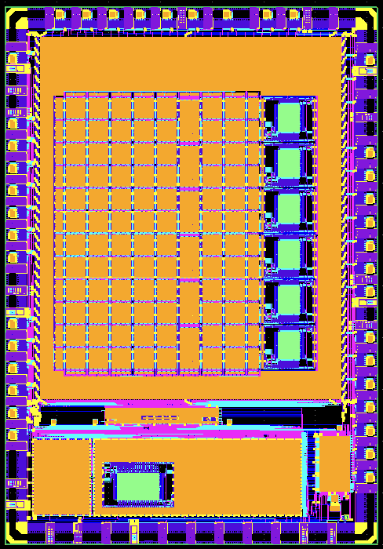

# Caravel User Project

  

Demonstration of the fully open FABulous eFPGA using the OpenLane flow.

This repo experiments an implementation of an eFPGA from RTL to GDS with open Skywater-130 PDK. The design RTL was generated by [FABulous framework](https://github.com/FPGA-Research-Manchester/FABulous). The fabric consists of 576x LUT4s (12x6 CLBs), 48x LUT5s (12x1 RegFiles), 6x DSPs and 6x BRAMs (6x1KB) with dual-ported memory blocks for register files and FIFOs. An embedded UART for configurations and CPU_IO interface (e.g., to RISC-V core) were also implemented in this version.

The fabrics were fully implemented using the [OpenLane flow](https://github.com/The-OpenROAD-Project/OpenLane.git) then integrated onto [eFabless caravel](https://github.com/efabless/caravel_user_project.git).   

   

   
   

